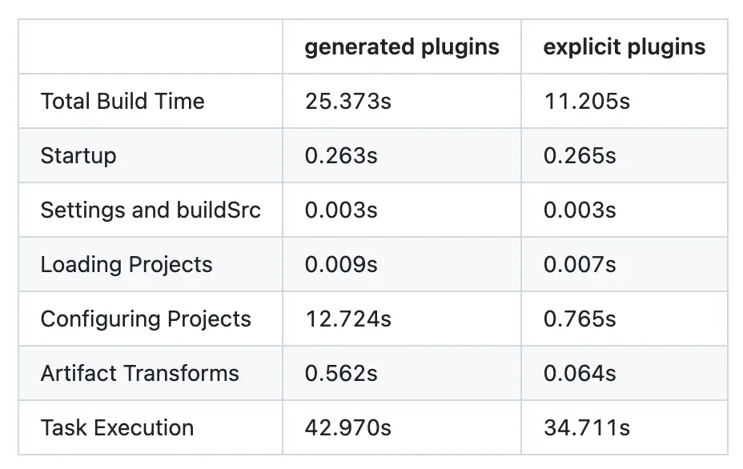

This series explores Gradle optimizations that challenge accepted wisdom. We'll question why we follow certain best practices, examine what trade-offs they actually impose, and discover when breaking the rules makes your build system better. Each article dives deep into a specific optimization, the problems it solves, and the new problems it creates.

In this first article, we'll explore the composite build pattern and why did Now in Android choose composite builds over buildSrc?

## The Fresh Eyes Problem

When I joined ANZx, on my first month, I checked out the repo. Then I switched to a different feature branch to review a PR. I kicked off the build.

And waited……and waited some more…….

> "Huh, that's weird," I thought. "I only changed branches. Why is it rebuilding everything?"

I checked the build output. Configuration cache invalidated. Every single module reconfiguring from scratch. I dig into the logs. There it was: changes detected in buildSrc. Someone had updated a plugin on the other branch. A small change, maybe a few lines. But Gradle treated it like a nuclear event. The entire build cache? Gone. Every optimization we'd carefully built up over previous builds? Reset.

I was surprised to find that a code base of this scale — over 300 modules, dozens of teams, a production banking app — was still using buildSrc for build logic. Not because buildSrc is inherently bad. It's not. For small projects, it's perfectly fine. Convenient, even.

But here's the thing: buildSrc is special in a way that doesn't scale. Every time you change anything in buildSrc — add a plugin, update a dependency, fix a typo — Gradle invalidates everything. Your configuration cache? Gone. Your incremental build optimizations? Reset. Every module in your project needs to be reconfigured from scratch. It's like Gradle saying, "I can't trust anything anymore, let's start over."

This is by design. buildSrc is a special directory within a Gradle project. It's compiled before anything else runs, always built with the same version of Gradle as the main project, and its outputs affect every single module. The key issue: changes in buildSrc invalidate the entire build cache. Gradle has no way to know what changed or what's affected, so it takes the safe route: rebuild everything. For a 10-module project, this is annoying. For a 100-module project? It's devastating.

*buildSrc vs Composite Build*

Composite builds are different. They're not special. They're just regular Gradle projects that happen to provide plugins. They can be built independently, cached separately, and only the parts that actually change invalidate the cache. Gradle can track changes at a much finer granularity — if you update one plugin in a composite build, only modules using that specific plugin need to reconfigure. You get all the benefits of custom build logic without the nuclear option every time you make a change.

## The Migration Strategy

Let's explore the buildSrc directory. This was the heart of the build system — the place where all our custom Gradle logic lived. Inside were dozens of custom plugins organized into two categories:

### Precompiled Script Plugins

A precompiled script plugin is a `.gradle.kts` (Kotlin DSL) or `.gradle` (Groovy DSL) script stored in a plugin source set (e.g. `buildSrc` or an included build like `build-logic`). Gradle automatically compiles it into a proper plugin class, packages it like a normal plugin, and assigns the plugin ID based on the file name.

### Binary Plugins (Class-based Plugins)

Binary plugins refer to plugins that are compiled and distributed as JAR files. These plugins are usually written in Java or Kotlin and provide custom functionality or tasks to a Gradle build.

The implementation was a mix of approaches — some plugins were precompiled scripts (`.gradle.kts` files that get compiled into classes), others were traditional class plugins implementing Gradle's `Plugin<Project>` interface.

Take a look at NowInAndroid, they was using Binary Plugins.

Have you ever wondered why we use class-based plugins instead of precompiled script plugins?

Precompiled scripts look so appealing. They're simple. Declarative. Less boilerplate than writing a full class. You just drop a `.gradle.kts` file in the right directory and Gradle handles the rest.

But here's what the Gradle documentation doesn't emphasize: when you use a precompiled script plugin, Gradle has to generate the actual plugin class at configuration time. Every configuration phase. That generation isn't free. The Android team's Now in Android project discovered this the hard way. When they switched from precompiled script plugins to explicit class-based plugins, their configuration time dropped from 12.7 seconds to 0.76 seconds — a **94% improvement**. Their total build time went from 25 seconds to 11 seconds.

*Running build using profile mode*

Because class-based plugins compile once. They're bytecode. They load fast. Precompiled scripts? Gradle regenerates them every single time.

## Best Practices: What We Learned About Build Architecture

Here's what I'd recommend:

### 1. Use Composite Builds If You Actively Develop Build Logic

If your team is actively developing custom plugins — adding features, fixing bugs, iterating on build logic — move to composite builds. The benefits are immediate:

- Changes to one plugin don't invalidate the entire project's configuration cache
- Only modules using the changed plugin need to reconfigure
- Developers can iterate on build logic without triggering 11-minute rebuilds for the team
- Each composite build project can have its own dependencies, versioning, and release cycle

buildSrc is fine for stable, rarely-changing build logic. But if you're treating build logic like production code (and you should), composite builds scale better.

### 2. Class-Based Plugins vs Precompiled Scripts: It Depends

**Prefer class-based plugins when:**

- Configuration time is a problem
- You need the full power of Gradle's API
- The plugin logic is complex
- Performance matters (class plugins compile once, precompiled scripts regenerate every configuration)

**Precompiled scripts can work when:**

- The plugin logic is genuinely simple and declarative
- You value the reduced boilerplate over configuration speed
- Your project is small enough that the generation overhead doesn't compound

Interestingly, DroidKaigi's conference app moved from class-based plugins in 2024 to precompiled scripts in 2025. Why? Probably for the same reason they're popular: simpler code, less boilerplate, easier for contributors to understand.

This is the trade-off. Precompiled scripts are easier to write and maintain. Class-based plugins are faster to execute. Pick the one that fits your constraints.

For us, with over 300 modules and active build logic development, class-based plugins were the clear win. Your mileage may vary. We ended up getting every plugins into Class-based plugins with a dedicated module for composite build. This drastically improve our developer velocity since we are not wasting time waiting for build after switching branch anymore. Big impact for a large team size. 👍
